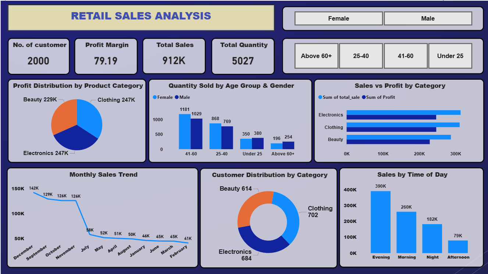

# Retail Sales Data Analysis Project

## Project Overview
This project analyzes retail sales data using SQL, Python, Excel and Power BI.

## Tools Used
- SQL (PostgreSQL)
- Python (Pandas)
- Power BI
- Excel

## Project Workflow
1. Data Cleaning
2. Data Analysis
3. SQL Queries
4. Dashboard Creation

## Key Insights
- Sales trends analysis
- Customer behavior analysis
- Product performance analysis

## Dashboard Preview

## Author
Abhishek Chauhan
Data Analyst
